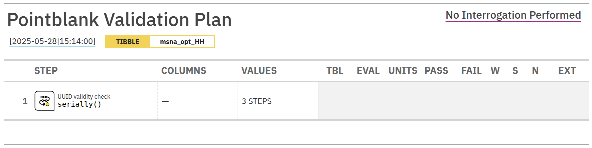
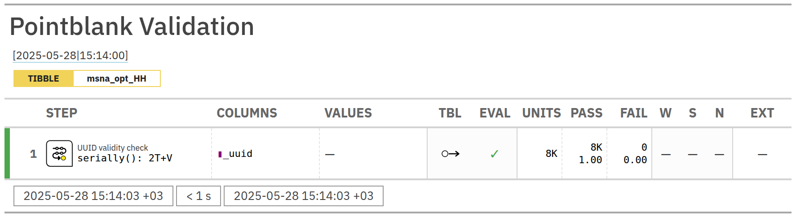

<!-- README.md is generated from README.Rmd. Please edit that file -->

```{r, include = FALSE}
knitr::opts_chunk$set(
  collapse = TRUE,
  comment = "#>",
  fig.path = "man/figures/README-",
  out.width = "100%"
)
```

# KQC

<!-- badges: start -->
[](https://lifecycle.r-lib.org/articles/stages.html#experimental)
<!-- badges: end -->


## Installation

You can install the development version of KQC like so:

``` r
# FILL THIS IN! HOW CAN PEOPLE INSTALL YOUR DEV PACKAGE?
```


## What does **KQC** do?  

*KQC* (Kobo Quality Checks) is an R package-in-progress that will let you:

1. **Validate an external cleaning log** against Kobo raw data and the XLS-form.  
2. **Apply** that log to generate a corrected ( “clean” ) dataset.  
3. **Run a minimal QC battery** – duplicate IDs, duplicate rows, soft duplicates and numeric outliers (with an exemption mechanism for values already justified in the cleaning log).  
4. **Export** the clean, PII-scrubbed data (XLSX/RDS) and – later – an HTML audit report, ready for download or hand-off.

A Shiny interface is planned so that non-coder colleagues can paste an asset-ID, attach a cleaning-log XLSX and get the same outputs with one click.

---

## Quick Start

```{r}
library(KQC)
library(pointblank)
library(gt)

msna_opt_HH[1:5, 1:4] |>
  gt()
```

```{r, message=FALSE, warning=FALSE}
agent <- create_agent(tbl = msna_opt_HH) |>
  col_is_uuid()
```

```{r echo=FALSE, results='hide', message=FALSE, warning=FALSE}
gt_table <- get_agent_x_list(agent)$report_object
gt::gtsave(gt_table, "man/figures/gt_table.png")
```

```{r, echo=FALSE, out.width="100%", fig.cap="A pointblank agent with a UUID column check.", fig.align="center", message=FALSE, warning=FALSE}

```

After running the interrogation, the agent will have a `status` column that indicates whether the checks passed or failed. You can also use the `get_agent_x_list()` function to extract the report object and save it as an HTML table.

```{r, echo=FALSE, results='hide', message=FALSE, warning=FALSE}
report <- agent |> interrogate()
gt_table <- get_agent_x_list(report)$report_object
gt::gtsave(gt_table, "man/figures/gt_table_int.png")
```

```{r, echo=FALSE, out.width="100%", fig.cap="A pointblank agent after interrogation", fig.align="center", message=FALSE, warning=FALSE}

```

```{r, echo=FALSE,  message=FALSE, warning=FALSE}
set.seed(1)
sample(c(msna_opt_HH$`_uuid`[1:10], NA_character_), 10, replace = TRUE) |>
  table(useNA = "ifany")
```
